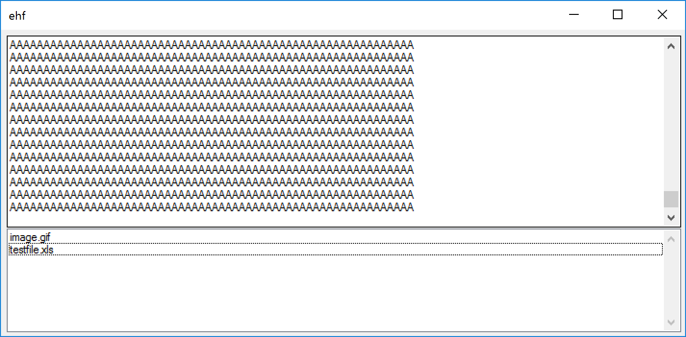

# ehf
email headers to attachment files

Simple GUI application to covert email headers with base64 attachments to files which can be openned from the application.

Usage:
1. Run the application
2. Paste complete header information into the top textbox
3. Double click any of the files listed in the bottom box
